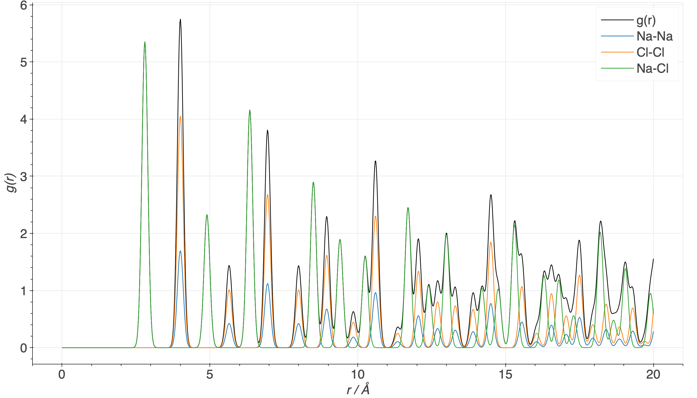
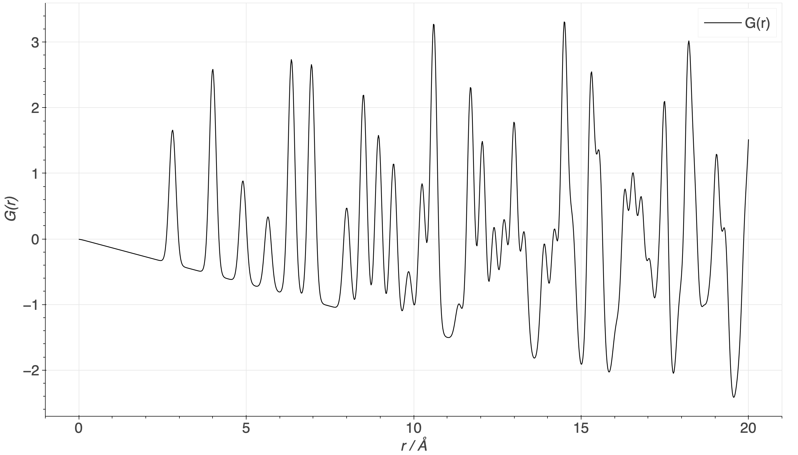

############
Introduction
############

***********************************
Various pair distribution functions
***********************************
There is a plethora of different pair distribution functions and various definitions. In this code, the definitions according to the book *Underneath the Bragg Peaks* by Takeshi Egami and Simon J.L. Billinge are used. :sup:`1` These are also the definitions used in the code *PDFgetX3*. :sup:`2`  Let us start with the following function:

.. math::
  R_{ij}(r) = \frac{1}{N}\ \frac{K_i K_j}{\langle K \rangle^2}\ n_{ij}(r)
.. math::
  R(r) = \displaystyle\sum_{i,j=1}^{n} R_{ij}(r)
  
.. figure:: NaCl_R_r.png
   :scale: 20 %
   :align:  center

   Computed G(r) function of NaCl.
  
Herein, :math:`n_{ij}(r)` is the number of atoms of type j between distances :math:`r` and :math:`r+\mathrm{d}r` from atoms of type i, :math:`N` is the number of atoms in the unit cell, :math:`K_i` and :math:`K_i` are the atomic numbers if atoms i and j, and :math:`\langle K \rangle` is the average atomic number of all atoms in the unit cell. While :math:`R(r)` is a very intuitive function, it is not commonly used because it oscillates around :math:`4\pi\rho r^2` (with the number density :math:`\rho`), making it unpractical for plotting. An alternative function is:
  
.. math::
  g_{ij}(r) = \frac{R_{ij}(r)}{4\pi\rho r^2}
.. math::
  g(r) = \displaystyle\sum_{i,j=1}^{n} g_{ij}(r)
  

   Computed g(r) function of NaCl.
  
:math:`g(r)` oscillates around 1 and is therefore much nicer to plot than  :math:`R(r)`. This is the default function used in xPDFsim. However, to obtain one of these functions from experimental data, one needs to make assumptions about the number density of the material. The function most commonly obtained from experimental data is:
  
.. math::
  G(r) = \frac{R(r)}{r}-4\pi\rho r\mathrm{d}r
  

   Computed G(r) function of NaCl.
  
In contrast to the functions above, :math:`G(r)` cannot be expressed as a linear combination of the underlying element-element correlations. 
  
*******
Sources
*******
1.  Egami, T. & Billinge, S. J. L. *Underneath the Bragg Peaks: Structural Analysis of Complex Materials* (Pergamon, 2003).
2. Juhás, P., Davis, T., Farrow, C. L. & Billinge, S. J. L. PDFgetX3: a rapid and highly automatable program for processing powder diffraction data into total scattering pair distribution functions. J. Appl. Crystallogr. 46, 560–566 (2013).